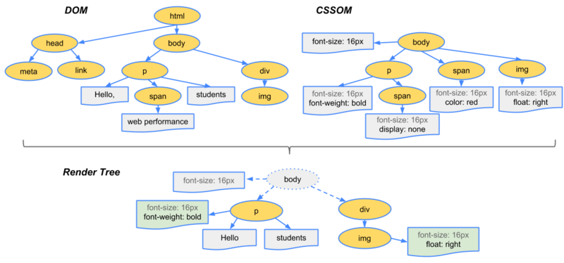

# 1.Viewport
```
name = "viewport"
content = ...
1."width=device-width,initial-scale=1"
2."maximum-scale = "1",minimum-scale="1"
3 user-scalable = "no"(默认yes)
```
# 2.跨域
 浏览器为了保护用户的隐私与数据安全而采用的同源策略,但是实际开发中,我们常常要请求其他地方的资源,此时就需要跨域

### 方法一(jsonp)
```
var oS = document.createElement('script');
oS.src = "www.baidu.com?xxx=xxxx&callback=function
document.head.append(oS)
```
### 方法二(服务端cors设置)
```
if(req.headers[origin].startsWith('指定域名')){
    res.setHeader('Access-Control-Allow-Origin', '*');  //处理跨域
}
```
# 3.javascript事件流

#### 事件捕获阶段
document --> target\
(如何阻止事件捕获:e.stopimmediatepropgation)

#### 事件冒泡阶段
target --> document\
(如何阻止事件冒泡:e.stopPropgation)

# 4.var let const
> (关于变量建议看看《你不知道的javascript》,笔者从底层出发,较为详细说明了javascript编译与执行过程)

var是个大bug,只要当前代码是同一作用域，var会发生预编译(也就是所谓的变量提升、En:hoisting),所以无论在当前作用域的哪一个位置声明变量(eg:var a = 1),var a 都会比 = 号先执行,function声明的优先级>var声明

另外var处于函数作用域⤵️
```
function varTest() {
 var x = 1;
    if (true) {
    var x = 2;  // 同样的变量!
    console.log(x);  // 2
  }
  console.log(x);  // 2
}
```
let变量声明处于一个块级作用域,处于一个暂存死区
[About let --MDN](https://developer.mozilla.org/zh-CN/docs/Web/JavaScript/Reference/Statements/let)

const声明创建一个值的只读引用,其引用是不可变的

# 5.箭头函数与函数声明

箭头函数语法: ()=>{}\
**箭头函数this指向当前执行环境**

普通的函数声明: function(){}\
**this指向调用者**

# 6.polling & long-poll

*polling(轮询)* 不停的去发送请求,请求后即可返回

*long-poll(长轮询)* 发送请求后一直等待,直到真正有数据的时候才返回,这种以类似polling的方式去发送请求减少了服务器发送的数据量

# 7.vue生命周期

```
1.beforeCreated

data = undefined,$el = undefined,this.message = undefined

2.created

data = [Object object],$el = undefined,this.message = 111

3.beforemounted

data = [Object object],$el = \<div id="app">{{message}}\</div>,this.message = 111

4.mounted

data = [Object object],$el = \<div id="app">111\</div>,this.message = 111

5.beforeupdated

data = [Object object],$el = \<div id="app">111\</div>,this.message = 222

6.updated

data = [Object object],$el = \<div id="app">222\</div>,this.message = 222

7.beforedestroyed

当前页面还未删除组件
data = [Object object],$el = \<div id="app">222\</div>,this.message = 222

8.destroyed

当前页面已经删除组件(eg:若app.message = xxx,视图不会发生变化)
data = [Object object],$el = \<div id="app">222\</div>,this.message = 222
```
# 8.innerHtml & createElement & docuemntFragemnt

- 当发生节点操作时，应该尽可能减少重绘与重排

## [点击这里->解释](https://coderwall.com/p/o9ws2g/why-you-should-always-append-dom-elements-using-documentfragments)

>虽然 DOM 为操作节点提供了细致入微的控制手段,但在需要给文档插入大量新 HTML 标记的情况 下,通过 DOM 操作仍然非常麻烦,因为不仅要创建一系列 DOM 节点,而且还要小心地按照正确的顺 序把它们连接起来。相对而言,使用插入标记的技术,直接插入 HTML 字符串不仅更简单,速度也更 快。以下与插入标记相关的 DOM 扩展已经纳入了 HTML5 规范。使用 innerHTML 属性也有一些限制。比如,在大多数浏览器中,通过 innerHTML 插入\<script>元素并不会执行其中的脚本。IE8 及更早版本是唯一能在这种情况下执行脚本的浏览器,但必须满足一 些条件。一是必须为\<script>元素指定 defer 属性,二是\<script>元素必须位于(微软所谓的)“有 作用域的元素”(scoped element)之后。\<script>元素被认为是“无作用域的元素”(NoScope element), 也就是在页面中看不到的元素,与\<style>元素或注释类似。如果通过 innerHTML 插入的字符串开头 就是一个“无作用域的元素”,那么 IE 会在解析这个字符串前先删除该元素。\
\
以上引自《Javascript高级程序设计》——11.3.6 插入标记

# 9.关于innerHtml的执行过程

先把插入节点的旧的内容都清除了,然后由浏览器来解析插入的字符串(这里浏览器会有一个Html解析器,这个解析器是浏览器级别的(一般是C++写的)。

[参考](https://www.jianshu.com/p/9c395724bbc5)

# 10.数组的快速乱序 & 字符串回文
```
乱序
let arr = [1,2,3,4,5,6,7]
arr.sort(()=>{ return Math.random() > 0.5 })

字符串回文
let str = 'asbcbhabhb'
str.split('').reverse().join('')
```

# 11.消除transition闪屏(先记录,暂时未遇到过)

### [原链接](https://segmentfault.com/a/1190000013331105)

```
.css{
    -webkit-transform-style: preserve-3d;
    -webkit-backface-visibility: hidden;
    -webkit-perspective: 1000;
}
    过渡动画（在没有启动硬件加速的情况下）会出现抖动的现象， 以上的 解决方案只是改变 视角 来启动硬件加速的一种方式；
    启动硬件加速的 另外一种方式： 

.css {
    -webkit-transform: translate3d(0,0,0);
    -moz-transform: translate3d(0,0,0);
    -ms-transform: translate3d(0,0,0);
    transform: translate3d(0,0,0);
}
    
    启动硬件加速
    最常用的方式：translate3d、translateZ、transform

    opacity属性/过渡动画（需要动画执行的过程中才会创建合成层，动画没有开始或结束后元素还会回到之前的状态）

    will-chang属性（这个比较偏僻），一般配合opacity与translate使用（而且经测试，除了上述可以引发硬件加速的属性外，
    其它属性并不会变成复合层），

    弊端： 硬件加速会导致 CPU性能占用量过大，电池电量消耗加大 ；因此 尽量避免泛滥使用硬件加速。

```
# 12.前端性能优化方法,一般分为哪些部分去考虑

    ## 个人看法 及 部分网络补充

    1. 网络层面 --- 各种资源的请求(css,js,png,jpg)

    1.1 尽量减小请求文件的体积，能压缩就压缩，能集成的图片就集成，在不影响用户体验的情况下将图片的体积减小
    1.2 另外，尽可能的减少请求次数，(最理想的就是一次请求加载所有资源,又能够以最少的时间加载首屏)
    1.3 减少首屏的dom操作，尽可能减少repaint和reflow
    1.5 gzip压缩
    1.6 巧用缓存
    (这里提到缓存需要好好的去理解他的过程(包括强制缓存和协商缓存))

    什么时候会发生强制缓存？
    Pragma:no-cache
    什么时候会发生协商缓存？

    2.代码优化的层面

    2.1减少dom操作，尽可能减少repaint和reflow
    2.2使用懒加载(当用户有意向去浏览某部分内容，才去请求站点资源)
    补：2.3. 避免空的src和href(当link标签的href属性为空、script标签的src属性为空的时候，
    浏览器渲染的时候会把当前页面的URL作为它们的属性值，从而把页面的内容加载进来作为它们的值。
    所以要避免犯这样的疏忽。)

    3.页面渲染层面 

    补： 3.1 减少dom操作，尽可能减少repaint和reflow
    3.2 使用懒加载(当用户有意向去浏览某部分内容，才去请求站点资源)
    3.3 把CSS放到顶部(网页上的资源加载时从上网下顺序加载的，所以css放在页面的顶部能够优先渲染页面，让用户感觉页面加载很快。）
    3.4 把JS放到底部(加载js时会对后续的资源造成阻塞，必须得等js加载完才去加载后续的文件 ，所以就把js放在页面底部最后加载。)
    3.5 将CSS和JS放到外部文件中(目的是缓存文件)

# 13.前端安全(xss和csfr)

XSS全称Cross-Site-Scripting(跨域脚本攻击),其原理是攻击者在某些特定的地方(某些后台读取数据的地方,例如：输入账户/评论框...)注入恶意字符串(例如:while(true){alert('HEHE')}),若前端没有校验后端也没有校验,则服务解析传送过来的字符串直接发送到用户,网站可能会挂掉,甚至可能泄密,相应的防御机制有1.前端字符串过滤(encodeURI)2.后端特定数据校验

[CSFR](https://zhuanlan.zhihu.com/p/22521378?utm_medium=social&utm_source=qq)
全称Cross-site-fogery-request(跨域请求伪造),其原理是伪造用户请求，做自己的事情，例如(某人在评论区写下惊世骇俗的标题，并做了一个链接,点击该链接(该链接包含一串恶意脚本),会伪造用户行为,让用户自动发送消息给朋友,或者做其他事情),此时就发送了一串CSFR,相应的防御机制有1.最好禁止GET请求2.服务端生成一个token发送到用户,当用户发生请求,都加上该token,与服务端生成的进行校验

# 14.浏览器端的Event loop

首先js从设计之初就是单线程的语言，另外event loop是一种实现异步的机制，浏览器端，event loop基于Javascript Run Time(运行环境)


所有事件都安排在主线程中执行,形成一个执行栈(Call Stack)，主线程外有一个任务队列(Task queue)，当发生异步操作时,会将该事件放入任务队列,主线程继续执行当前任务栈中的事件，当执行栈为空(即事件执行完后)，会去消息队列中找未执行的事件并执行，主线程重复以上操作就是Event loop.

!(定时器并不是特例。到达时间点后，会形成一个事件（timeout事件）。不同的是一般事件是靠底层系统或者线程池之类的产生事件，但定时器事件是靠事件循环不停检查系统时间来判定是否到达时间点来产生事件)

最后通过一个视频来生动的讲述这个过程,[点我](https://2014.jsconf.eu/speakers/philip-roberts-what-the-heck-is-the-event-loop-anyway.html)

# 15.Node-Event loop

一个简化的eventloop操作(图自nodejs官网)
```
   ┌───────────────────────┐
┌─>│        timers         │
│  └──────────┬────────────┘
│  ┌──────────┴────────────┐
│  │     I/O callbacks     │
│  └──────────┬────────────┘
│  ┌──────────┴────────────┐
│  │     idle, prepare     │
│  └──────────┬────────────┘      ┌───────────────┐
│  ┌──────────┴────────────┐      │   incoming:   │
│  │         poll          │<─────┤  connections, │
│  └──────────┬────────────┘      │   data, etc.  │
│  ┌──────────┴────────────┐      └───────────────┘
│  │        check          │
│  └──────────┬────────────┘
│  ┌──────────┴────────────┐
└──┤    close callbacks    │
   └───────────────────────┘
```

如上图所示，node的eventloop包含六个阶段，***每个阶段都有一个FIFO的回调队列（queue）要执行。而每个阶段有自己的特殊之处，简单说，就是当event loop进入某个阶段后，会执行该阶段特定的（任意）操作，然后才会执行这个阶段的队列里的回调。当队列被执行完，或者执行的回调数量达到上限后，event loop会进入下个阶段。***

## Phases Overview(阶段总览)
- timers(setTimeout,setInterval)
- I/O(执行一些系统操作的回调，除了setTimeout,setImmediate,close)
- idle,prepare(某些内部操作)
- poll(io操作,node会在适当条件下阻塞在这里)
- check(执行setImmediate)
- close callbacks(执行socket.on('close',...)的类似操作) 

附带一个人觉得讲的很好[Node_Eventloop](https://github.com/creeperyang/blog/issues/26)

# 16.http缓存

[参考](https://developer.mozilla.org/zh-CN/docs/Web/HTTP/Caching_FAQ)

```
缓存涉及的部分头部字段

1.Pragma(1.0)
no-cache  与Cache-Control: no-cache 效果一致。强制要求缓存服务器在返回缓存的版本之前将请求提交到源头服务器进行验证。

2.expires(1.0)服务端生成返回的到期时间

3.cache-control(S->C)
no-cache:必须先与服务器确认返回的响应是否发生了变化，然后才能使用该响应来满足后续对同一网址的请求。因此，如果存在合适的验证令牌 (ETag)，no-cache 会发起往返通信来验证缓存的响应，但如果资源未发生变化，则可避免下载。
max-age = 400 缓存时间400s
private 私有缓存(只能应用于本地浏览器私有缓存中)
public 共享缓存(即该响应可被任何中间人(代理,CDN)缓存)
no-store 不缓存

4.if-modified-since:Sun, 08 Apr 2018 09:49:44 GMT(C->S)资源缓存的日期 

5.Last-modified:Sun, 08 Apr 2018 09:49:44 GMT(S->C)资源的最后修改日期

6.Etag:asdsaxxxxxx(S->C)  服务器响应请求时，告诉浏览器当前资源在服务器的唯一标识（生成规则由服务器决定）。

7.if-none-match:asdsaxxxxxx(C->S)  客户端发请求时，告知服务器上次接收的唯一标识，若相同则使用缓存(304)，不同则请求资源

**优先级比较**
Cache-control > expires

Etag > if-modified-since
```

# 17.浏览器渲染一个页面的过程

[参考](https://segmentfault.com/a/1190000014070240)

假设该页面结构如下
```
<html>
  <head>
    <meta name="viewport" content="width=device-width,initial-scale=1">
    <link href="style.css" rel="stylesheet">
    <title>Critical Path</title>
  </head>
  <body>
    <p>Hello <span>web performance</span> students!</p>
    <div></div>
  </body>
</html>
```

1.获取html文档,逐步解析并生成dom tree

**无论是DOM还是CSSOM，都是要经过Bytes → characters → tokens → nodes → object model这个过程。⬇️**


2.获取css资源后,生成cssom tree

3.生成Render tree(将dom tree与cssom tree结合)⬇️

*DOM树从根节点开始遍历可见节点，这里之所以强调了“可见”，是因为如果遇到设置了类似display: none;的不可见节点，在render过程中是会被跳过的（但visibility: hidden; opacity: 0这种仍旧占据空间的节点不会被跳过render），保存各个节点的样式信息及其余节点的从属关系。*


4.布局(Layout)

5.Paint(绘制)

**关于重排(reflow)与重绘(repaint)**

reflow:Dom tree发生改变,浏览器执行1-5的过程

repaint:某些元素的状态发生改变(例如:color,backgroundColor),但Dom tree没有发生变化,则重新绘制这些元素

# 18.TCP & UDP

[暂存连接](https://blog.csdn.net/monkeynote/article/details/45868085)

[关于TCP的三次握手](https://github.com/jawil/blog/issues/14)
```
TCP(Transmission Control Protocol)
三次握手，四次分手
1.保持连接的状态(全双工)
2.有拥塞机制
3.保证传输可靠性
4.首部20字节
--多应用于文件传输(对数据的准确性要求高)--

UDP(User Datagram Protocol)
1.不保证连接状态
2.不保证数据安全送达
3.首部8字节
4.没有拥塞机制
--多应用于视频,直播,网络语音等应用(对数据传输速率要求高)--
```

# 19.垂直居中

1.line-height:height;(块级元素)

2.display:inline-block;verticle-align:middle;

3.display:flex; align-items:center

4.position:absolute;top:50%;margin-top:-0.5*height;

5.position:relative|absolute;top:50%;transform:translateY(-50%)

# 20.水平居中

1.text-align:center;

2.display:flex;justify-content:center;

3.position:absolute;left:50%;margin-left:-0.5*width;

4.position:relative|absolute;left:50%;transform:translateX(-50%)

# 21.GET & POST

GET: 
1.参数显示在URL上,因此安全性也较
2.大小有限制
3.可被缓存
4.仅允许ASCII字符

POST:
1.数据不显示在URL上,相比GET,安全性高一丢丢
2.大小无限制
3.不可被缓存
4.允许传输二进制数据

# 22.Cookie & localStorage & SessionStorage
```
Cookie

//创建cookie
date = new Date().toGMTString()
documetn.cookie = "username=XXX;expires=date"
//删除某个cookie
data = new Date().toGMTString()-10000(设置时间过期)
documetn.cookie = "username=XXX;expires=date"

--cookie的存储大小仅为4KB左右,且有过期时间,另外，cookie会被用于与服务端交互,而另外两种则仅在客户端使用--


LocalStorage

//设置
-LocalStorage.key = value
-LocalStorage.setItem("key",value)
//删除
-LocalStorage.removeItem("key")

--LocalStorage存储大小为5M左右，且无过期时间(除非被删除)--


SessionStorage(会话概念)

与LocalStorage用法差不多

--SessionStorage存储大小为5M左右,仅在当前会话下有效，关闭页面或浏览器后被清除--
```
About Session:

1.Session是啥?
2.为啥有Session?
3.Session有啥用？
4.Session怎么用？

Answer:
1.首先,Session翻译过来就是“会话”,通俗的举一个栗子,场景如下:
    王大明:刘梅梅,how r u?
    刘梅梅:I'm fine,3Q,and u?
    王大明:I‘m fine,too.
    刘梅梅:Ok,goodbye.
好了,以上就是一个会话。是不是很通俗？

2.好,通俗的了解了Session后,我们思考一下,为什么网络通信中会出现Session。这里我们需要知道,http协议是[无状态的](https://www.zhihu.com/question/23202402),知道了无状态这个概念后,这里我们提一个日常生活随处可见的例子:二次自动登录,我们知道cookie可以在客户端存储4KB左右的东西,但是我们不可能把密码直接放到cookie,这样太危险了,这时候就出现了Session。

3.Session为用户分配一个仅有的SessionID,并记录用户的登录状态,过期时间等。

4.暂时略过(尝试之后就补上)

https://blog.csdn.net/think2me/article/details/38726429 

https://blog.csdn.net/macsnow/article/details/6893191

# 23.AMD/CMD & Commonjs & ES6 module

CMD--Common Module Definition/AMD-Asynchronus Module Definition(用于客户端)异步加载
```
//Seajs
//mod.js2
define(function(){

    exports.a = 1

    //module.exports 只能出现一次
    module.exports = {
        a:12,
        b:33,
        show:function(){

        }
    }
})

require(['mod'],function(mod){

})
```

Commonjs(应用于服务端)
同步加载
```
//lib.js
//为了方便，Node为每个模块提供一个exports变量，指向module.exports。这等同在每个模块头部，有一行这样的命令。
//var exports = module.exports
//http://javascript.ruanyifeng.com/nodejs/module.html#toc3

exports.a = xxx
module.exports = {}

//main.js
const mod = require('./lib')//文件路径若去掉./,则会去node_modules文件夹中找此模块
```

ES6(浏览器厂商未完全实现)
```
export {a:1}

export default {}

import name from './xxx'
```
> Commonjs和AMD的加载机制和ES6不同，前两者都是在运行时进行模块加载，而ES6中则是在编译阶段就发生模块加载。另外，前两者都是对值的拷贝，而ES6中则是对值的引用

（未写完,回来再补）

# 24.onscroll & onresize & onInput 渲染问题之解决措施(节流与防抖动)

首先,我们要知道为什么发生scroll | resize | input 的时候会发生渲染问题,这里，我们要较为清楚的理解浏览器的(渲染过程)[上17]

知道了浏览器的渲染机制后,我们就可以开始分析了,当用户进行scroll等操作时,我们是无法直接控制dom事件的触发频率的,若scroll的回调函数内部有较多的dom操作或者是引起浏览器reflow和repaint的操作,那就很有可能,在用户scroll一次的情况下没办法完成对应的操作,此时，如果不做任何处理,用户不停的scroll就会看到浏览器抖动或者卡顿或者是其他渲染问题(**根据非官方测试,在智能手机上，慢慢滚动一下，一秒可以触发事件100次之多。这么高的执行频率，你的滚动回调函数压力大吗？**),因此,对应用户不同的行为(一种是不停的scroll,一种是例如用户手指下滑,加载图片),我们采取防抖动和节流的方法来处理

```

//防抖动
function debounce(func,timeout){

    var Timeout

    return function(){

        var context = this,args = arguments

        console.log(args)

        clearTimeout(Timeout)

        func.apply(context,args) //个人理解:此处这样做的目的是由于函数传过来的参数个数是未知的,因此我们可以用apply传回给函数

        Timeout = setTimeout(func,timeout)

    }
}

function Animation(){ ... }

window.addEventlistener('scroll',debounce(Animation,500))


//节流(所谓节流就是限制回调函数在特定的时间至少执行特定的次数)
function throttle(func,Limittime){

    var timeout,start = new Date()

    return function(){

        var ars = arugments,
            context = this,
            cur = new Date()

        clearTimeout(timeout)

        if(cur - start >= Limittime){
            func.apply(context,args)
            start = cur
        }else{
            timeout = setTimeout(func,wait)
        }
    }

}

function Animation(){ ... }

windonw.addEventListener('scroll',throttle(Animation,1000))
```

新API(requestAnimationFrame:根据MDN的描述,requestAnimationFrame被调用为每秒60帧,即回调函数每1000/60ms 执行一次)

CSS : pointer-events:none;//应用场景(性能优化):当我们监听scroll的时候可能会触发hover,添加该属性后便会禁掉鼠标(无法触发click,hover...),这样一度程度上提升了性能

[_underscore源码](http://underscorejs.org/docs/underscore.html)

[参考](https://www.cnblogs.com/coco1s/p/5499469.html)

# 25.[ECMA规范](http://www.ecma-international.org/ecma-262/8.0/)与[Javascript解析器](http://esprima.org/demo/parse.html#)

# 26.[前端优化](https://github.com/zwwill/blog/issues/1)

---

> 以上资料部分由本人平时积累总结，部分借鉴于网络，小白无意冒犯，若侵犯到您的权益，望告知。