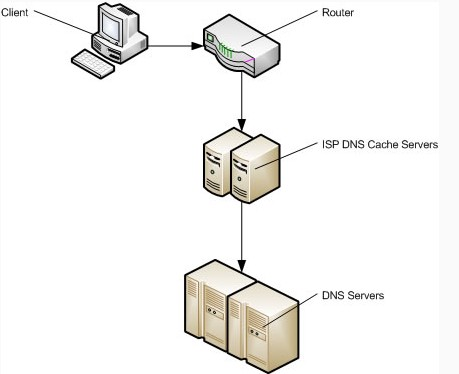
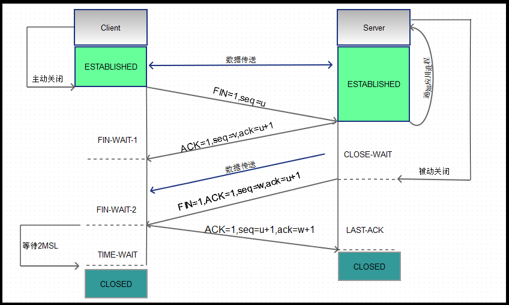

# HTTP(HyperText Transfer Protocol)

[1.HTTP特点](#1http特点)

[2.HTTP报文组成](#2http报文组成)

[3.GET & POST](#3GET-&-POST)

[4.DNS解析](#4dns解析)

[5.缓存](#5缓存)

[6.TCP三次握手与四次分手的过程](#6tcp三次握手&四次分手)

[7.HTTP方法](#7http方法)

[8.HTTP状态码](#8http状态码)

&nbsp;

## 1.HTTP特点

### ①无连接

连接一次就断

### ②无状态

下一次连接，服务端没办法记住你的身份(尽管你刚刚和服务次进行了一次通信)

### ③灵活

通过请求头的信息完成各种传输

### ④简单快速

每个资源(例如,URI)是固定的,处理简单

&nbsp;

## 2.HTTP报文组成

### 请求报文

1.请求行(GET / URL / 1.1) 2.请求头(各种key:value) 3.空行 4.请求体

```javascript
GET /search?hl=zh-CN&source=hp&q=domety&aq=f&oq= HTTP/1.1
Accept: image/gif, image/x-xbitmap, image/jpeg, image/pjpeg, application/vnd.ms-excel, application/vnd.ms-powerpoint,
application/msword, application/x-silverlight
```

### 响应报文

1.状态行 2.响应头 3.空行 4.响应体

```javascript
HTTP/1.1 200 OK
Date: Sat, 31 Dec 2005 23:59:59 GMT
Content-Type: text/html;charset=ISO-8859-1
Content-Length: 122

＜html＞
  ＜head＞
    ＜title＞Wrox Homepage＜/title＞
  ＜/head＞
  ＜body＞
    ＜!-- body goes here --＞
  ＜/body＞
＜/html＞
```

&nbsp;

## 3.GET & POST

### ①浏览器回退的话,GET请求是无害的,而POST会再次发起

### ②GET请求数据会显示在URL上,POST请求放在Request header中

### ③请求参数:GET请求参数有大小限制2K左右,POST请求无限制

### ④GET请求只能进行URL编码,POST请求可以为多种类型的编码

### ⑤GET产生的URL是可以被收藏的,而POST不可以

### ⑥GET请求会被浏览器主动缓存,而POST不会

### ⑦GET请求的参数只能为ASCII码,而POST没有限制

&nbsp;

## 4.DNS解析

典型的一次DNS解析耗费20-120 毫秒

浏览器对网站第一次的域名DNS解析查找流程依次为:

**浏览器缓存**-**系统缓存**-**路由器缓存**-**ISP DNS缓存**-**递归搜索**



&nbsp;

## 5.缓存

缓存的过程其实就是两位兄弟打交道的过程。

浏览器第一次跟服务器取资源,服务器会给浏览器一些缓存相关信息(http1.0和http1.1所携带的信息是不同的)

缓存的类型分**强制缓存**和**协商缓存**

### 强制缓存

(以前用的)http1.0:

第一次

浏览器(大兄弟给我点资源) -> 服务器(如果成功接收请求:好的,小兄弟接着(xxx一些资源),请求头部携带expires,pragma)

浏览器接收到资源后会缓存资源

第二次交流

浏览器(浏览器根据***expires:<>***日期,pragma字段,若expires时间大于当前时间,且pragma值不为no-store,则直接在缓存里面取得资源,否则,找服务器请求资源)

***✨另外:命中强制缓存的情况下，不会向服务器发起请求,资源是from disk cache(具体可看底部参考文章)***

> expires:GMT Date 表示资源的过期时间\
\
> pragma:no-cache  表示强制要求缓存服务器在返回缓存的版本之前将请求提交到源头服务器进行验证。与 Cache-Control: no-cache 效果一致。--引自[MDN](https://developer.mozilla.org/zh-CN/docs/Web/HTTP/Headers/Pragma)

### 协商缓存

(现在用的)http1.1:

第一次

浏览器(大兄弟给我点资源) -> 服务器(如果成功接收请求:好的,小兄弟接着(xxx一些资源),请求头部携带expires,pragma,**cache-control**,**Last-modified**,**Etag**)

浏览器接收到资源后同样会缓存资源

第二次

浏览器(大兄弟给我点资源,附带**cache-control:\<xxx(no-cache/max-age/public...)\>**,**if-modified-since:\<Last-modified-time(GMT)\>**,**if-none-match:\<Etag-value\>**头信息,如果**cache-control**为no-store则不缓存) -> 服务器(如果成功接收请求:我来看看你请求的资源改动的时间是否和**if-modified-since**一致或者**ETag**(修改标识符)是否一致,若一致则返回http304,表示使用缓存资源)

***✨另外:若发起协商缓存的情况下,资源是from memory cache(具体可看底部参考文章)***

> cache-control(优先级大于expires): 通用消息头被用于在http 请求和响应中通过指定指令来实现缓存机制。缓存指令是单向的, 这意味着在请求设置的指令，在响应中不一定包含相同的指令。--引自[MDN](https://developer.mozilla.org/zh-CN/docs/Web/HTTP/Headers/Cache-Control)
\
\
> Last-modified-since: If-Modified-Since 是一个条件式请求首部，服务器只在所请求的资源在给定的日期时间之后对内容进行过修改的情况下才会将资源返回，状态码为 200  。如果请求的资源从那时起未经修改，那么返回一个不带有消息主体的  304  响应，而在 Last-Modified 首部中会带有上次修改时间。 不同于  If-Unmodified-Since, If-Modified-Since 只可以用在 GET 或 HEAD 请求中。当与 If-None-Match 一同出现时，它（If-Modified-Since）会被忽略掉，除非服务器不支持 If-None-Match。--引自[MDN](https://developer.mozilla.org/zh-CN/docs/Web/HTTP/Headers/If-Modified-Since)
\
\
>Etag:ETagHTTP响应头是资源的特定版本的标识符。这可以让缓存更高效，并节省带宽，因为如果内容没有改变，Web服务器不需要发送完整的响应。而如果内容发生了变化，使用ETag有助于防止资源的同时更新相互覆盖（“空中碰撞”）。如果给定URL中的资源更改，则一定要生成新的Etag值。 因此Etags类似于指纹，也可能被某些服务器用于跟踪。 比较etags能快速确定此资源是否变化，但也可能被跟踪服务器永久存留。--引自[MDN](https://developer.mozilla.org/zh-CN/docs/Web/HTTP/Headers/ETag)

(以后用的)http2.0(暂不知道，可查看RFC文档提案)

&nbsp;

## 6.TCP三次握手&四次分手

### 三次握手(客户端发起)


①.第一次握手：建立连接。客户端发送连接请求报文段，将SYN位置为1，Sequence Number为x；然后，客户端进入SYN_SEND状态，等待服务器的确认

②.第二次握手：服务器收到SYN报文段。服务器收到客户端的SYN报文段，需要对这个SYN报文段进行确认，设置(ack)Acknowledgment Number为x+1(Sequence Number+1)；同时，自己自己还要发送SYN请求信息，将SYN位置为1，Sequence Number为y；服务器端将上述所有信息放到一个报文段（即SYN+ACK报文段）中，一并发送给客户端，此时服务器进入SYN_RECV状态；

③.第三次握手：客户端收到服务器的SYN+**ACK**(这里大写的ACK是同步位,不是指ack,两者区别可参考[ack&ACK](http://blog.51cto.com/oldpan/2043818))报文段。然后将Acknowledgment Number设置为y+1，向服务器发送ACK报文段，这个报文段发送完毕以后，客户端和服务器端都进入ESTABLISHED状态，完成TCP三次握手。

### 四次分手



第一次分手：主机1（可以使客户端，也可以是服务器端），设置Sequence Number和Acknowledgment Number，向主机2发送一个FIN报文段；此时，主机1进入FIN_WAIT_1状态；这表示主机1没有数据要发送给主机2了

第二次分手：主机2收到了主机1发送的FIN报文段，向主机1回一个ACK报文段，Acknowledgment Number为Sequence Number加1；主机1进入FIN_WAIT_2状态；主机2告诉主机1，我“同意”你的关闭请求,主机2进入CLOSW_WAIT状态

第三次分手：主机2向主机1发送FIN报文段，请求关闭连接，同时主机2进入LAST_ACK状态

第四次分手：主机1收到主机2发送的FIN报文段，向主机2发送ACK报文段，然后主机1进入TIME_WAIT状态；主机2收到主机1的ACK报文段以后，就关闭连接；此时，主机1等待2MSL后依然没有收到回复，则证明Server端已正常关闭，那好，主机1也可以关闭连接了。

&nbsp;

## 7.HTTP方法

①.GET(获取资源)

②.POST(提交数据)

③.PUT(更新)

④.DELETE(资源删除)

⑤.HEAD(获得报文首部)

⑥.PATCH(只更新改变的数据)

⑦.OPTIONS(探测可用方法,响应头Access-Control-Allow-Methods: POST, GET, OPTIONS...)

&nbsp;

## 8.HTTP状态码

### 1xx 指示信息 -- 请求发起,服务端已接收,继续处理

### 2xx 成功发起请求,得到服务器回应

### 3xx 资源重定向 -- 要完成请求需更进一步工作

### 4xx 客户端错误 -- 请求语法错误 or 请求无法实现

### 5xx 服务器错误 -- 服务器未能实现合法请求

**常见状态码:**

101 协议升级

200 成功返回请求资源

204 返回请求头(不携带请求体)

206 Partial Content:客户端发送了一个带有range头的GET请求

301 永久重定向

302 临时重定向

304 使用缓存资源

401 未授权(Unauthorized)

403 服务器拒绝提供服务(Forbidden)

404 资源不存在(Not Found)

500 服务器内部错误

502 网关错误(Bad gateway)

503 服务器不可用(Service unavailable)

504 网关超时(Gateway timeout)

&nbsp;

参考:

[缓存了解一下](https://excaliburhan.com/post/things-you-should-know-about-browser-cache.html)

[DNS预解析提高性能](http://skyhome.cn/div_css/301.html)

[TCP/IP](https://github.com/jawil/blog/issues/14)

(不断完善中...)