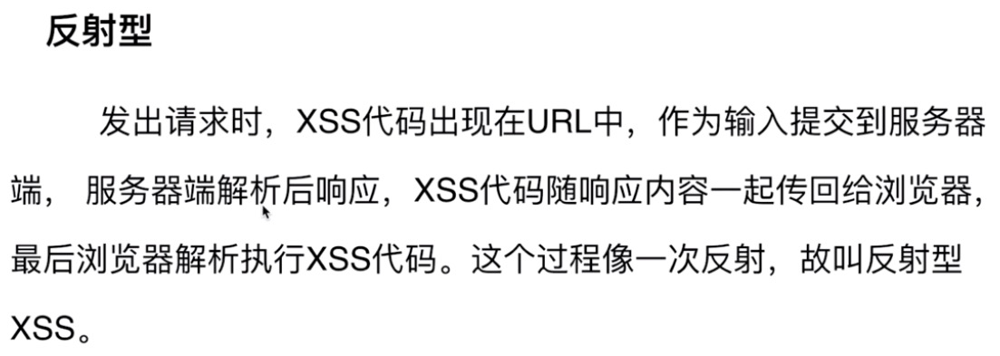

# 前端安全浅析

## XSS(Cross-site-script) 跨站脚本攻击

此类攻击可分为两种类型:反射性和存储型

防御措施: 编码(encodeURI),过滤(某些标签或者事件,例如iframe,onerror)。

## CSRF(Cross-site-request-fogery) 跨站请求伪造

基本原理:用户需先登录网站,保存了个人信息(cookie),通过某种手段获取到用户的权限执行黑客想要的行为。(例如关注用户,新增粉丝数)

防御措施: token,Referer(页面来源)验证