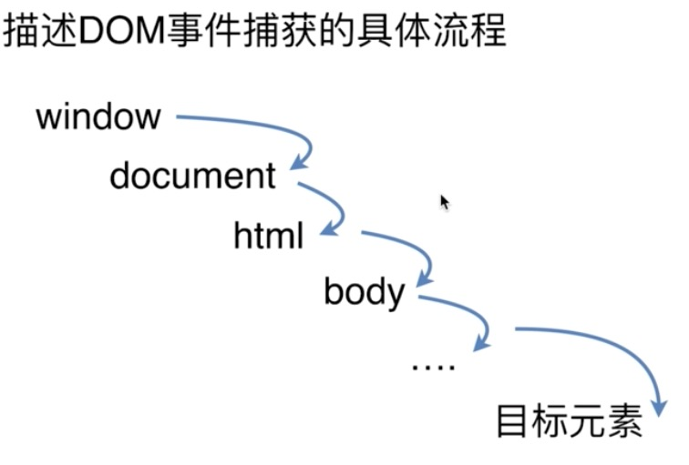

# Javascript

[1.ajax](#1ajax)

[2.跨域](#2跨域)

[3.new过程模拟](#3new过程模拟)

[4.Dom事件流](#4dom事件流)

[5.原型链](#5原型链)

[6.Javascript中的继承](#6javascript中的继承)

[7.回调地狱](#7回调地狱)

[8.浏览器端的事件循环](#8浏览器端的事件循环)

[9.重温var、let、const](#9var、let、const)

&nbsp;

## 1.ajax

```javascript
function ajax(options) {

  options.url = options.url || ''
  options.type = options.type || 'GET'
  options.data = options.data || {}
  options.dataType = options.dataType || 'json'

  // IE兼容处理
  var xhr = XMLHttpRequest ? new XMLHttpRequest : new ActiveXObject('Microsoft.XMLHTTP')

  let data = options.data

  if (options.type === 'GET') {
    let arr = []
    for (let i in data) {
      arr.push(`${i}=${data[i]}`)
    }
    let strdata = arr.join('&')
    xhr.open('GET', options.url + '?' + strdata, true)
    xhr.send()
  }

  if (options.type === 'POST') {
    xhr.open('POST', options.url, true)
    xhr.setRequestHeader('content-type', 'application/x-www-form-urlencoded')
    xhr.send(data)
  }

  // xhr.onreadystatechange 当一个 XMLHttpRequest 请求被 abort() 方法取消时，其对应的 readystatechange 事件不会被触发。
  // https://developer.mozilla.org/en-US/docs/Web/API/XMLHttpRequest/onreadystatechange
  xhr.onload = function () {
    if (xhr.status == 200 || xhr.status == 304) {
      options.success()
    } else {
      options.error()
    }
  }
}
```

&nbsp;

## 2.跨域

### 2.1 JSONP

```javascript
let sc = document.createElement('script')
sc.src = 'http://www.xxx.com?a=1&b=2&cb=do'
document.body.append(sc)
```

### 2.2 后端设置Cross-Access-Allow-Origin

```javascript
this.set('Cross-Access-Allow-Origin','*')
```

### 2.3 document.domain跨域(前提主域相同)

例如:www.a.com引入了www.a.b.com的页面

在www.a.b.com中设置

```javascript
document.domain = 'a.com'
```

### 2.4 postMessage跨域

```javascript
// 父窗体像子窗体发送消息
let win = document.getElementsByTagName('iframe')[0].contentWindow
win.postMessagge('hello',*)

// 子窗体进行监听
window.addEventListener('message', onMessage, false);

var onMessage = function(){
  console.log(e, e.data);
  if(e.origin != "http://moweide.gitcafe.io"){
    return false;
  }
  // 消息处理...
}
```

### 2.5 websocket跨域

由于websocket使用的socket协议,不采取同源策略因此默认支持跨域

### 2.6 Hash

情境: 页面A中有个iframeB

```javascript
let data = xxx //你要传输的数据

let B = document.querySelector('iframe')
B.src += '#' + `${data}`

B.onhashchange = function () {
  let data = window.location.hash
}
```

### 2.7 CORS(Cross-Origin-Resource-Sharing)

>CORS的基本原理是通过设置HTTP请求和返回中header，告知浏览器该请求是合法的。这涉及到服务器端和浏览器端双方的设置：请求的发起(Http Request Header)和服务器对请求正确的响应（Http response header）。\
\
>我们使用ajax请求进行跨域时,浏览器是会自动添加一些头信息的(浏览器检测到是ajax跨域请求会在请求头添加Origin: www.xx.com),有时会多出一次附加请求,用户是不会感知到的,而CORS是W3C提出的跨域请求方式。

这种方式需要客户端和服务端同时支持

&nbsp;

## 3.new过程模拟

```javascript
// 新对象被创建
function new2(func){
  // 1.继承构造函数的原型对象
  var o = Object.create(func.prototype)
  // 2.构造函数被执行,同时上下文会被指定为这个新实例
  var obj = func.call(o)
  console.log(obj)
  // 3.如果构造函数返回一个“对象”,那么这个对象会取代整个new出来的结果,
  // 如果没有返回对象则new出来的结果为步骤1的对象
  if(typeof obj === 'object'){
    return obj
  }else{
    return o
  }
}

function cons (name){
  this.name = name
  this.say = function(){console.log('say')}
  // 补充:使用new关键字的时候，javascript帮我们自动加了return this
  return this
}

var obj1 = new2(cons)
```

总结:

1.创建一个新的该构造函数的原型对象

2.将该构造函数绑定到该原型对象(即改变this指向)

3.return 该原型对象

&nbsp;

## 4.DOM事件流

### 4.1 事件模型

首先,DOM事件模型其实就是捕获和冒泡,
DOM事件流分三个阶段,分别是捕获阶段,目标阶段,冒泡阶段

**捕获阶段** :



**冒泡阶段** :

上图中的箭头逆置一下就是冒泡阶段。

提及Dom事件流就不能不谈一下事件对象

### 4.2 事件对象(Event)

#### event.preventDefault() || e.returnValue = false || return false 阻止默认事件

#### event.stopPropagation() || event.cancelBubble = true 阻止捕获和冒泡

#### event.stopImmediatePropagation() 阻止捕获和冒泡,并阻止事件冒泡并且阻止相同事件的其他侦听器被调用。

#### event.currentTarget 当前绑定事件的元素

#### event.target 当前被点击的元素

### 4.3 自定义事件

```javascript
// 创建
var eve = new Event('custome') // 不可传参

var eve2 = new CustomEvent('custom',{}) // 带参数

// 注册
ev.addEventListener('custome',function () {
  console.log('custome')
})

//触发
ev.dispatchEvent(eve)
```

&nbsp;

## 5.原型链

>原型链(Prototype Chain)的基本思想是,利用原型让一个引用类型继承另一个引用类型的属性和方法。--《Javascript高级程序设计》

### 5.1 创建对象有几种方式

```javascript
// 1
var o1 = {name:'o1'}
o1 = new Object({name:'o1'})

// 2
function o2 (name) {this.name = name}
new o2('o2')

// 3
var o3 = Object.create({name:'o3'})
```

### 5.2 Prototype && __proto__

```javascript
function fn (name) {this.name = name}
var obj = new fn('obj')

fn.prototype.constructor === fn

obj.__proto__ === fn.prototype
```

实际运用中,使用原型链的目的是可以通过实例对象中的__proto__不断的网上寻找属性或者方法的一条路,直到Object.prototype,当找到该属性or方法便会停止往上找,因此javascript的继承是基于原型链的。

### 5.3 Funciton

```javascript
function fn (name) {this.name = name}
fn.__proto__ === Function.prototype
```

可查阅ECMA规范,[摘录来自ECMAScript 5.1规范的4.3.24小节:](http://yanhaijing.com/es5/#null)

>对象类型的成员，标准内置构造器 Function的一个实例，并且可做为子程序被调用。\
\
>注： 函数除了拥有命名的属性，还包含可执行代码、状态，用来确定被调用时的行为。函数的代码不限于 ECMAScript。

&nbsp;

## 6.Javascript中的继承

ES5

### 6.1 借助构造函数继承

```javascript
function Parent(){
  this.name = 'parent'
}

function Child(){
  Parent.call(this)
  this.subname = 'child'
}
```

缺点:通过改变上下文,只是部分继承了属性,原型链上的方法和属性没有被继承

### 6.2 通过原型链继承

```javascript
function Parent(){
  this.name = 'parent'
}

function Child(){
  this.subname = 'child'
}
Child.prototype = new Parent()

let c1 = new Child()
let c2 = new Child()

c1.name = 'change'
c2.name // change
```

缺点:由于父对象属性被共享,某一实例改变了原型链上的属性，其他实例也受影响,而且实例构造函数为Parent

### 6.3 组合继承

```javascript
function Parent(){
  this.name = 'parent'
}

function Child(){
  Parent.call(this) // 1
  this.subname = 'child'
}
Child.prototype = new Parent() // 2
```

缺点:父构造函数被调用了两次,同时属性共享仍然未解决,实例构造函数为Parent

### 6.4 组合继承优化

```javascript
function Parent(){
  this.name = 'parent'
}

function Child(){
  Parent.call(this)
  this.subname = 'child'
}
Child.prototype = Parent.prototype
```

优点:父构造函数被调用一次
缺点:同时属性共享仍然未解决,实例构造函数为Parent

### 6.5 组合继承优化2

```javascript
function Parent(){
  this.name = 'parent'
}

function Child(){
  Parent.call(this)
  this.subname = 'child'
}

Child.prototype = Object.create(Parent.prototype)
Child.prototype.constructor = Child
```

ES6

```javascript
class Parent {
  constructor (name) {
    this.name = name
  }
}

class child extends Parent {
  constructor (subname) {
    this.subname = subname
  }
}
```

&nbsp;

## 7.回调地狱

什么是回调地狱(Callback hell)?

```javascript
fs.readdir(source, function (err, files) {
  if (err) {
    console.log('Error finding files: ' + err)
  } else {
    files.forEach(function (filename, fileIndex) {
      console.log(filename)
      gm(source + filename).size(function (err, values) {
        if (err) {
          console.log('Error identifying file size: ' + err)
        } else {
          console.log(filename + ' : ' + values)
          aspect = (values.width / values.height)
          widths.forEach(function (width, widthIndex) {
            height = Math.round(width / aspect)
            console.log('resizing ' + filename + 'to ' + height + 'x' + height)
            this.resize(width, height).write(dest + 'w' + width + '_' + filename, function(err) {
              if (err) console.log('Error writing file: ' + err)
            })
          }.bind(this))
        }
      })
    })
  }
})
```

### 如何解决回调地狱？

1.不要多层嵌套函数。将函数命名，并且放置在程序的顶层。

2.好好利用JS的函数声明提升这一特性，将函数放置在文件末尾。

3.处理好函数回调过程中的每一个可能的报错信息，可以通过检查器比如 standard来帮助你做这件事情。

4.编写可复用的函数并将其模块化，从而降低用于阅读、理解代码的消耗；将代码拆分成多个小组件，有利于处理错误信息、编写测试程序，也有利于你编写稳定的、文档化的API以及代码重构。

避免回调地狱最重要的一方面，应该是将函数抽离出来。这么做可以让整个程序流更便于阅读和理解，也让新接触该程序的人不必在乎所有的细枝末节而把握住程序真正的目的。

&nbsp;

## 8.浏览器端的事件循环

首先要明确的是,事件循环是实现异步操作的一种方式。另外,这里讨论的是浏览器端的事件循环(非Node)。

一个视频告诉你!  [Go](https://2014.jsconf.eu/speakers/philip-roberts-what-the-heck-is-the-event-loop-anyway.html)

所有事件都安排在主线程中执行,形成一个执行栈(Call Stack)，主线程外有一个任务队列(Task queue)，当发生异步操作时,会将该事件放入任务队列,主线程继续执行当前执行栈中的事件，当执行栈为空(即事件执行完后)，会去消息队列中找未执行的事件并执行，主线程重复以上操作就是Event loop.

&nbsp;

## 9.var、let、const

重温var、let、const,与变量提升的一些思考。

其实变量提升并不是专业的说法,只是大家口中所表述其现象的一种描述

```javascript
console.log(a) //undefined
var a = 1

console.log(b) //Reference Error:b is not defined
let b = 2
```

我们可以将以上代码的执行逻辑抽象的看做为1.创建变量、2.初始化、3.赋值

而在js执行环境中,**var的执行顺序**为

* 1.创建变量

* 2.初始化为undefined

* 3.执行代码

* 4.赋值a = 1

let的执行顺序为

* 1.创建变量

* 2.执行代码

* 3.初始化为2(若代码为let x则初始化为undefined)

const的执行顺序为(**注意:**const没有赋值)

* 1.创建变量

* 2.初始化

而且,**当使用let关键字创建变量过程报错后,变量就会永远处于创建状态**

```javascript
let x = x //报错

let x = 1 //后面对该变量无论做任何操作都会报错
```

&nbsp;

参考:

[回调地狱](https://www.jianshu.com/p/d31d2ecb4162)

[事件循环](https://2014.jsconf.eu/speakers/philip-roberts-what-the-heck-is-the-event-loop-anyway.html)

[我用两个月理解let](https://zhuanlan.zhihu.com/p/28140450)

(不断完善中...)